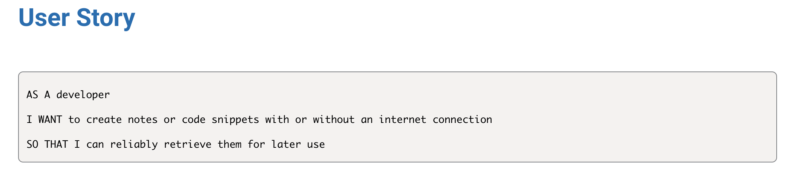
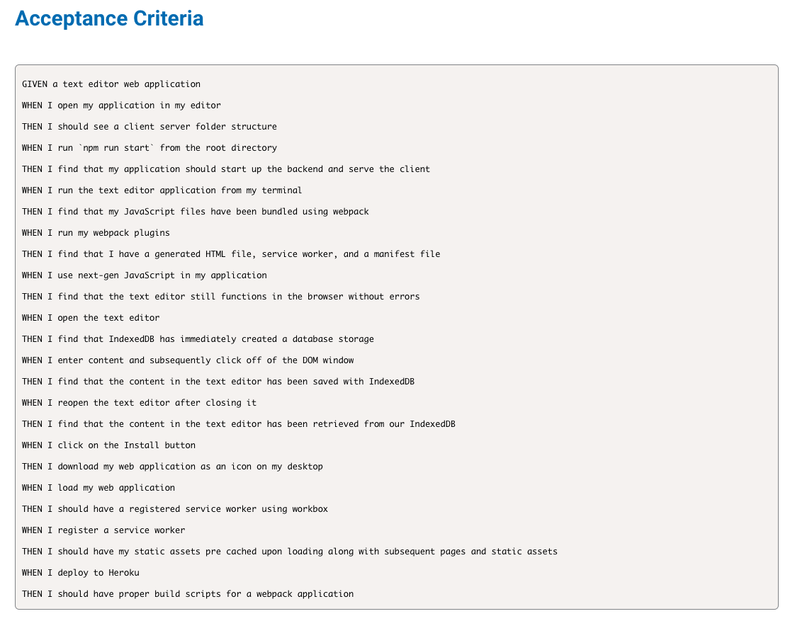

# Text Editor

  
  ## Table of Contents
  - [Project description](#description)
  - [Installation](#installation)
  - [Usage](#usage)
  - [Collaborators](#collaborators)
  - [How to Contribute](#contributing)
  - [Testing](#tests)
  - [License](#license)
  ## Description 
This is a text editor that runs in the browser. It's a single page application that meets the PWA criteria. It features a number of data persistence techniques that seve as redundancy in case one of the options is not supported by the browser. It also functions offline.

  ## Installation
 Clone the repository and then run the command npm install. This will install the following npm packages:

* Express
* Webpack
* Webpack Dev Server
* Webpack Pwa Manifest
* Babel
* CSS Loader
* Concurrently
* IndexedDB
  
## Usage 
Run npm run start from the root directory to start up the backend and serve the client.

To use JATE, click here to open the application in the browser. To use JATE application offline, you can go to the link and click "install" to download to your applications.

## Questions?
Please contact me at:
GitHub: https://github.com/elawilliam
Email: ela.witham@gmail.com
  
## License 
Text editor is licensed under the: 
  
  